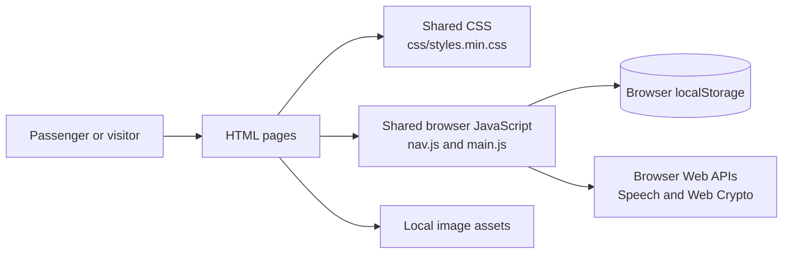
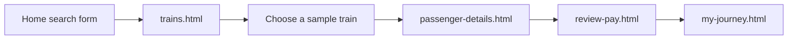

# IRCTC-ReVamped
# BuildWhatMovesIndia - Entry

> A student-built, multi-page redesign prototype for making common railway tasks easier to find and use.

IRCTC-ReVamped brings journey planning, PNR lookup, train status, refunds, meals, profile management, and related travel services into one clearer interface. It is designed as a hackathon-style frontend prototype: it demonstrates the user experience and browser interactions, but it is **not connected to IRCTC**, real train inventory, payments, identity verification, or a production backend.

## The problem we are addressing

Rail passengers often need to move between several tasks—searching trains, checking a PNR, tracking a refund, ordering food, and finding service links. This project explores a more approachable, responsive interface that groups those tasks into focused pages while keeping shared navigation and assistance available throughout the site.

## Credentials for LogIn

User id: public@irctc.test
Password: PublicDemo2026!

## What works today

| Area | Current behaviour | Data source / limitation |
| --- | --- | --- |
| Journey search | Station suggestions, journey-date validation, class/quota choices, and navigation to train results | Demo station data and static results |
| Train results | Filterable train-result cards and booking entry points | Hard-coded sample trains; no live availability |
| Passenger and review flow | Passenger form, review/payment page, and a journey confirmation screen | UI-only flow; no reservation or payment is created |
| Account and profile | Browser-only registration/sign-in, local profile editing, document-form validation, and a simulated verification/OTP experience | Stored in the browser with `localStorage`; not real authentication or verification |
| PNR, train status, refunds, and vacancy | Input validation and sample result/timeline views | Fixed demo content; no railway API calls |
| Meals | E-Pantry PNR entry, six sample menu cards, food imagery, and client-side add-to-cart button state | No restaurant, cart persistence, or ordering backend |
| Other services | Cards and links for flights, hotels, buses, holiday packages, and railway-related services | Informational/static links only |
| Shared experience | Responsive navigation, language selection, live display clock, announcements, and a draggable assistant panel with quick replies and optional browser voice controls | The assistant is keyword/rule based, not an AI API |

## Current architecture

The application is currently a static multi-page website. Each page loads shared CSS and JavaScript directly from this repository. There are no `fetch` calls, implemented API routes, database connections, server-side sessions, or runtime backend files in the current source tree.



### Important implementation detail

All HTML pages load `css/styles.min.css`, while `css/styles.css` is the readable stylesheet source. Keep both aligned when changing shared styles; editing only the unminified file will not update what the browser loads.

## Planned backend architecture—not implemented yet

[`BACKEND_ARCHITECTURE.md`](BACKEND_ARCHITECTURE.md) is an implementation contract for a later backend. It describes a target architecture with an API gateway, a Reliability & Safety Layer, Auth/Search/Booking/PNR/Refund services, PostgreSQL, Redis, Kafka, monitoring, and reconciliation. None of those services are present in the current repository.

```mermaid
flowchart LR
    B[Browser] --> W[CDN / WAF]
    W --> G[API gateway]
    G --> R[Reliability & Safety Layer]
    R --> S["Auth &#124; Search &#124; Booking &#124; PNR &#124; Refund"]
    S --> P[(PostgreSQL)]
    S --> D[(Redis)]
    S --> K[Kafka]
    K --> N[Notifications / workers / analytics]
```



This diagram documents the intended direction, not the current deployment. The current frontend must remain the presentation layer when that work begins; it should be integrated incrementally instead of rewritten.

## Main user flows

### Search to booking demo



The screens establish the intended booking journey, but no transaction is sent or saved outside the browser.

### Account and profile demo

1. The shared navigation opens the registration/sign-in dialog.
2. Demo account state is written to `localStorage` under `irctc-auth-session`.
3. A signed-in user can open `profile.html` and save personal/profile fields locally, keyed to the account email.
4. The profile page can simulate document and OTP verification. It does not contact an identity provider and must not be treated as real verification.
5. `passenger-details.html` can use a completed local demo profile to prefill passenger information.

### Help assistant

The shared assistant is injected by `js/nav.js`; its message rendering, keyword replies, quick actions, drag behaviour, localization, speech synthesis, and speech recognition hooks live in `js/main.js`. It answers only from client-side rules and demo copy.

## Technology stack

| Technology | How it is used here |
| --- | --- |
| HTML5 | Separate, focused pages for each passenger task |
| CSS3 | Shared responsive layout, navigation, cards, forms, and visual styling |
| Vanilla JavaScript | Page interactions, validation, filtering, shared navigation, profile behaviour, chatbot UI, and demo state |
| `localStorage` | Local-only demo accounts, session/profile state, language preference, booking intent, and assistant position |
| Web Crypto API | SHA-256 hashing used by the browser-only demo account flow; it is not a replacement for server-side password handling |
| Web Speech API | Optional browser speech synthesis and speech recognition controls in the assistant when supported |
| Local PNG/JPG assets | Logos, service icons, chatbot artwork, and pantry food images in `icons-package/assets/` |

There is no frontend framework, bundler, database, Express server, REST API, or package-managed application runtime currently checked into this project.

## Project structure

```text
IRCTC-ReVamped/
├── index.html                    # Home/search page
├── trains.html                   # Sample train results
├── passenger-details.html        # Passenger details step
├── review-pay.html               # Review and payment demo
├── my-journey.html               # Journey confirmation/demo
├── pnr.html                      # PNR lookup demo
├── train-status.html             # Train-status view
├── refund-tracker.html           # Refund-tracking view
├── meals.html                    # Meals landing page
├── pantry.html                   # E-Pantry demo menu
├── services.html                 # Other travel/rail services
├── profile.html                  # Local demo profile page
├── alerts.html, contact.html, help.html, loyalty.html, sitemap.html, vacancy.html
├── css/
│   ├── styles.css                # Readable shared stylesheet source
│   └── styles.min.css            # Stylesheet loaded by every HTML page
├── js/
│   ├── nav.js                    # Shared nav, auth dialogs, footer, assistant shell
│   ├── main.js                   # Shared interactions, assistant, localization, demo views
│   ├── booking.js                # Passenger-profile prefill helper
│   └── profile.js                # Browser-only profile and simulated verification flow
├── icons-package/assets/         # UI, logo, assistant, service, and food assets
├── BACKEND_ARCHITECTURE.md       # Future backend implementation contract
└── LICENSE                       # MIT license
```

## Run locally

### Requirements

- A modern browser.
- A local static-file server is recommended so the pages are accessed over HTTP.

There is no root `package.json` or provided `npm start` command in the current project. From the repository root, one simple option is:

```powershell
python -m http.server 8000
```

Then open [http://localhost:8000/](http://localhost:8000/) in a browser. Any equivalent static-file server can be used.

Because the project uses relative asset and page links, serve the repository root as the site root. No database, Redis instance, Node server, or API configuration is needed for the current frontend.

## Environment variables

The current static frontend does not read any environment variables.

An untracked local `.env` file may exist in a developer workspace from earlier backend experimentation, but the current source tree has no backend/configuration code that consumes it. Do not put credentials, real identity data, or secrets into frontend files, and do not commit a local `.env` file.

If the planned backend is implemented later, its required environment-variable contract should be added alongside that backend and documented with a safe `.env.example`. That configuration does not exist yet.

## Deployment

Today, this project can be deployed as a static website on a host that serves the repository files and preserves relative asset paths. There is currently no checked-in deployment configuration, build step, CI workflow, backend deployment, or production environment-variable setup.

Deployment of the architecture described in `BACKEND_ARCHITECTURE.md` will require separate backend hosting and managed configuration for its database, Redis, sessions, and other services. That work is not part of the current implementation.

## Key technical decisions

| Decision | Why it fits the current project |
| --- | --- |
| Multi-page HTML instead of a SPA | Each major passenger task is easy to open, review, and demo independently without a framework or build process. |
| Shared `nav.js` and `main.js` | Keeps navigation, the assistant shell, language state, and common interactions consistent across pages. |
| Shared stylesheet | Maintains a common visual system and responsive behavior; the minified file is used directly by the pages. |
| Local demo state | Makes the prototype immediately runnable without external services. It is intentionally not used as a production data model. |
| Local image assets with descriptive `alt` text | Keeps the interface self-contained and gives service cards recognizable visuals without remote dependencies. |
| Backend architecture documented separately | Gives the project a clear growth path while protecting the existing frontend from an unnecessary rewrite. |

## Current boundaries and future improvements

### Implemented now

- A complete visual, responsive, multi-page passenger experience.
- Client-side validation and interactions for the documented demo flows.
- Local demo account/profile state and simulated profile verification.
- Shared navigation, language preference, assistant panel, and local assets.

### Not implemented yet

- Real authentication, secure server-side sessions, password storage, authorization, audit logs, or account recovery.
- PostgreSQL, Redis, Kafka, Express/API routes, database migrations, or any other backend service.
- Live train search, availability, PNR status, train tracking, payment, refunds, food ordering, notifications, or real identity/document verification.
- Automated tests, a build pipeline, CI, or checked-in deployment configuration.

### Sensible next steps

When the team is ready to move beyond the prototype, follow `BACKEND_ARCHITECTURE.md` incrementally: first introduce a secure backend foundation and real account/session handling, then replace individual demo data paths with authenticated APIs. Preserve the existing pages and their routes as the frontend contract while those integrations are added.

## Security and demo-data note

This repository is a prototype. Browser-side state can be inspected or changed by the user, and its local hashing/demo verification must not be treated as production security. Do not enter real passwords, government document numbers, payment details, or personal travel data into the demo.

## License

## Vansh Mayekar & Rohit Ghorpade ##
This project is available under the [MIT License](LICENSE).
