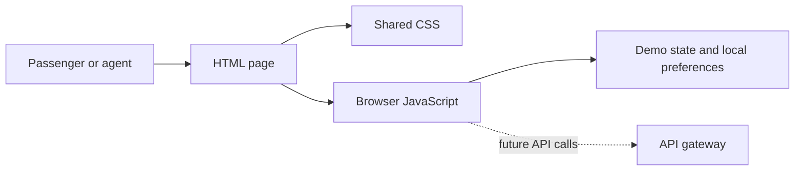

# IRCTC-ReVamp
# BuildWhatMovesIndia - Entry

## Overview

IRCTC-ReVamp is a responsive frontend prototype for planning and managing Indian railway journeys. It reorganizes common tasks such as train search, PNR lookup, train status, refunds, meals, services, and profile management into a clearer, more accessible interface. The current project is a static HTML, CSS, and JavaScript prototype. Its backend design is documented as an implementation contract and should be treated as a production blueprint, not as a live IRCTC integration.

## Frontend

Each workflow is represented by a focused HTML page, with shared presentation rules in `css/styles.css` and the browser-ready `css/styles.min.css`. `js/nav.js` creates the shared header, footer, authentication dialog, and help assistant. `js/main.js`, `js/booking.js`, and `js/profile.js` provide client-side interactions, demo state, language controls, form behavior, and local profile preferences. The interface uses semantic headings, labels, links, buttons, keyboard-friendly controls, responsive grids, and descriptive image alt text. Icon assets are kept in `icons-package/assets` and referenced with paths relative to each page.



The frontend should remain a presentation and interaction layer. It must never be trusted to enforce fares, permissions, payment results, booking ownership, or ERS integrity because users can modify browser code and requests. In production, loading states, server errors, retry limits, and clear confirmation states should be added around every network operation.

## Backend Architecture

The planned backend places a CDN/WAF and API gateway in front of a Reliability and Safety Layer (RSL). The RSL handles request IDs, validation, authentication, role-based access control, rate limits, idempotency, admission control, bounded retries, and circuit breakers. Domain services then manage authentication, search, booking, PNR, and refunds.

```mermaid
flowchart LR
	B[Browser] --> W[CDN / WAF]
	W --> G[API gateway]
	G --> R[RSL]
	R --> S[Auth | Search | Booking | PNR | Refund]
	S --> D[(PostgreSQL)]
	S --> X[(Redis)]
	S --> K[Kafka events]
	K --> N[Notifications]
	K --> Q[Refund workers]
	S --> M[Monitoring and reconciliation]
```

PostgreSQL is the durable source of truth for accounts, bookings, payments, refunds, and audit records. Redis stores short-lived server sessions, OTP/risk state, rate counters, and cache entries. Kafka carries durable asynchronous events; consumers must be idempotent and use retries plus dead-letter topics. An outbox and reconciliation process prevent payment, booking, and notification mismatches.

## Security

Passwords should be hashed only by the authentication service using Argon2id. Successful login creates a random, short-lived server-side session in Redis and sends only a `Secure`, `HttpOnly`, `SameSite` cookie to the browser. Responses must use generic authentication errors so account existence is not disclosed. All security events, declarations, login attempts, and agent actions should include an account ID, request ID, timestamp, and audit record.

Authorization is enforced server-side with explicit roles. Agent bookings require an active agent profile and registered Agent User ID; a modified browser must not bypass fare or ERS checks. Every mutation requires authenticated access, strict input validation, CSRF protection where cookie authentication is used, rate limiting, and an idempotency key. TLS, secret management, dependency updates, secure headers, least-privilege database access, backups, monitoring, and alerting complete the defense in depth.


